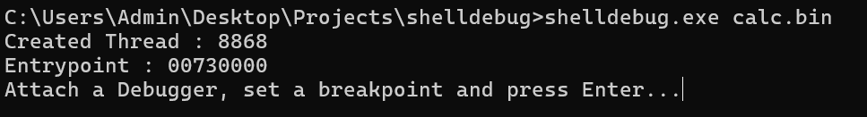

# shelldebug
Tool that allows to run and attach a debugger to windows shellcode

This tool is inspired by https://github.com/OALabs/BlobRunner/ . I saw it being used in a blog post and wanted to re-implement it. S/O to the OALabs guys!

## How to use:
- Run the tool with shellcode as argument

  

- Attach x32/x64dbg to the created thread
- Set a breakpoint at the entrypoint address provided by the tool
- Press Enter
